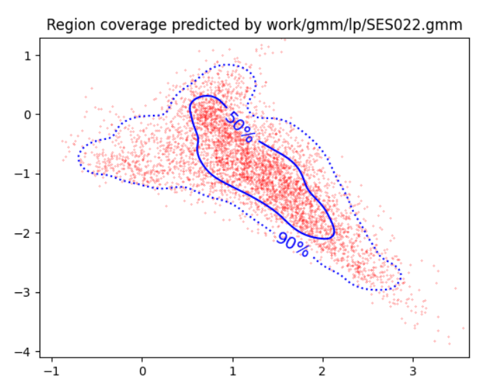
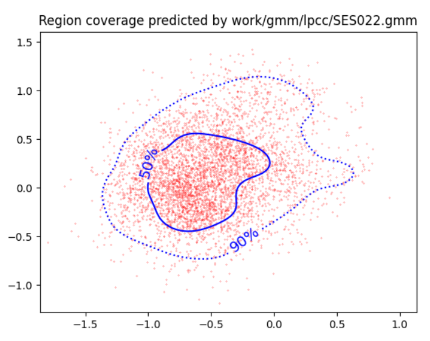
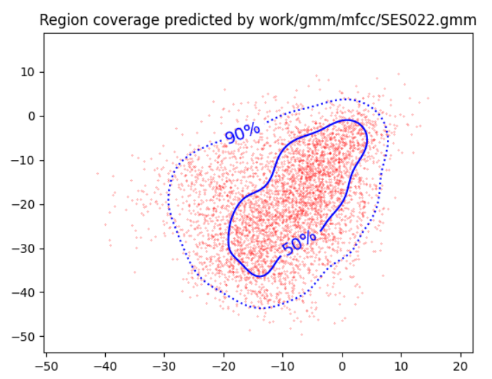
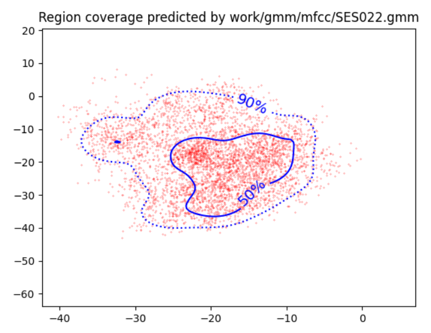
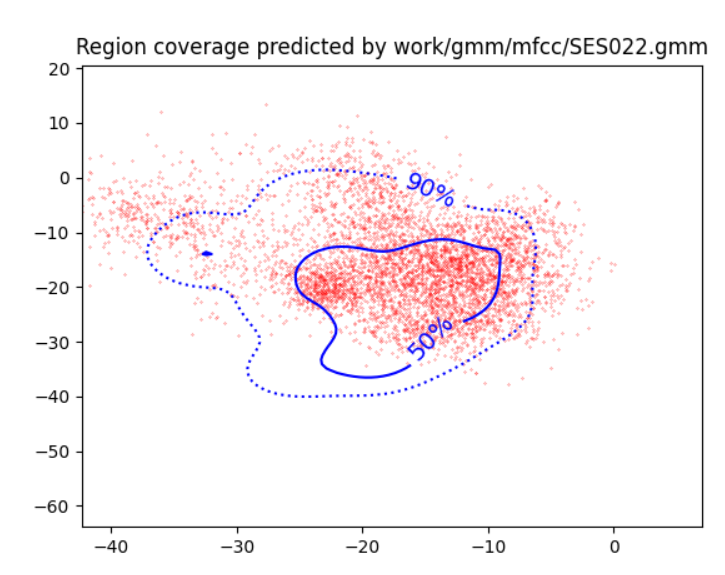

PAV - P4: reconocimiento y verificación del locutor
===================================================

Obtenga su copia del repositorio de la práctica accediendo a [Práctica 4](https://github.com/albino-pav/P4)
y pulsando sobre el botón `Fork` situado en la esquina superior derecha. A continuación, siga las
instrucciones de la [Práctica 2](https://github.com/albino-pav/P2) para crear una rama con el apellido de
los integrantes del grupo de prácticas, dar de alta al resto de integrantes como colaboradores del proyecto
y crear la copias locales del repositorio.

También debe descomprimir, en el directorio `PAV/P4`, el fichero [db_8mu.tgz](https://atenea.upc.edu/mod/resource/view.php?id=3654387?forcedownload=1)
con la base de datos oral que se utilizará en la parte experimental de la práctica.

Como entrega deberá realizar un *pull request* con el contenido de su copia del repositorio. Recuerde
que los ficheros entregados deberán estar en condiciones de ser ejecutados con sólo ejecutar:

~~~~~~~~~~~~~~~~~~~~~~~~~~~~~~~~~~~~~~~~~~~~~~~~~~~~~.sh
  make release
  run_spkid mfcc train test classerr verify verifyerr
~~~~~~~~~~~~~~~~~~~~~~~~~~~~~~~~~~~~~~~~~~~~~~~~~~~~~

Recuerde que, además de los trabajos indicados en esta parte básica, también deberá realizar un proyecto
de ampliación, del cual deberá subir una memoria explicativa a Atenea y los ficheros correspondientes al
repositorio de la práctica.

A modo de memoria de la parte básica, complete, en este mismo documento y usando el formato *markdown*, los
ejercicios indicados.

## Ejercicios.

### SPTK, Sox y los scripts de extracción de características.

- Analice el script `wav2lp.sh` y explique la misión de los distintos comandos involucrados en el *pipeline*
  principal (`sox`, `$X2X`, `$FRAME`, `$WINDOW` y `$LPC`). Explique el significado de cada una de las 
  opciones empleadas y de sus valores.
  - `SoX`: (Sound eXchange) es una herramienta que permite convertir archivos de audio entre diferentes formatos, así como aplicar diferentes efectos.
  - `$X2X`: Es un programa de SPTK que permite la conversión entre diferentes formatos de datos. En nuestro caso lo usamos para pasar de signed int de 16 bits a short float y de float a ascii para guardar en un fichero la fmatrix.
  - `$FRAME`: Es un programa de SPTK que nos permite extraer frames tramas de una secuencia proporcionandole un periodo P (de 80 muestras) y una longitud de trama L (de 240 muestras).
  - `$WINDOW`: Es un programa de SPTK que devuelve el resultado de la multiplicación de una trama por una ventana. Nosotros usamos la ventana de Blackman (por defecto).
  - `$LPC`: Es un programa de SPTK que extrae los coeficientes de predicción lineal de una trama entrante.

- Explique el procedimiento seguido para obtener un fichero de formato *fmatrix* a partir de los ficheros de salida de SPTK (líneas 45 a 51 del script `wav2lp.sh`).

  ~~~~~~~~~~~~~~~~~~~~~~~~~~~~~~~~~~~~~~~~~~~~~~~~~~~~~~~~~~~~~~~~~~~~.sh
  # Main command for feature extration
  sox $inputfile -t raw -e signed -b 16 - | $X2X +sf | $FRAME -l 240 -p 80 | $WINDOW -l 240 -L 240 |
	$LPC -l 240 -m $lpc_order > $base.lp || exit 1
   
  # Our array files need a header with the number of cols and rows:
  ncol=$((lpc_order+1)) # lpc p =>  (gain a1 a2 ... ap) 
  nrow=`$X2X +fa < $base.lp | wc -l | perl -ne 'print $_/'$ncol', "\n";'`
  ~~~~~~~~~~~~~~~~~~~~~~~~~~~~~~~~~~~~~~~~~~~~~~~~~~~~~~~~~~~~~~~~~~~~~~

  Primero, con `sox`convertimos la señal al tipo de dato signed int de 16 bits y con x2x pasamos a short float, que es como trabaja SPTK. Después se extraen frames de esta señal y se aplica el enventanado. Finalmente, extraemos los coeficientes lpc y los guardamos en el archivo temporal. Calculamos el numero de columnas, que es "lpc_order+1" (el numero de coeficientes más la ganancia), y el numero de filas a partir del fichero, con la herramienta wordcount (wc -l). Así, usamos estos numeros como cabecera del archivo final y copiamos la matriz del fichero temporal seguidamente.

  * ¿Por qué es más conveniente el formato *fmatrix* que el SPTK?

  Porque permite tener los datos de forma ordenada, haciendo más fácil el acceso a ellos.

- Escriba el *pipeline* principal usado para calcular los coeficientes cepstrales de predicción lineal
  (LPCC) en su fichero <code>scripts/wav2lpcc.sh</code>:

~~~~~~~~~~~~~~~~~~~~~~~~~~~~~~~~~~~~~~~~~~~~~~~~.sh
sox $inputfile -t raw -e signed -b 16 - | $X2X +sf | $FRAME -l 240 -p 80 | $WINDOW -l 240 -L 240 |
	$LPC -l 240 -m $lpcorder | $LPCC -m $lpcorder -M $lpccorder > $base.lp
~~~~~~~~~~~~~~~~~~~~~~~~~~~~~~~~~~~~~~~~~~~~~~~~
Para calcular los coeficientes cepstrales de predicción lineal (LPCC) primero se obtienen los LPC, y luego se usa el programa `$lpc2c` para aplicar el cepstrum.

- Escriba el *pipeline* principal usado para calcular los coeficientes cepstrales en escala Mel (MFCC) en su
  fichero <code>scripts/wav2mfcc.sh</code>:

~~~~~~~~~~~~~~~~~~~~~~~~~~~~~~~~~~~~~~~~~~~~~~~~.sh
sox $inputfile -t raw -e signed -b 16 - | $X2X +sf | $FRAME -l 240 -p 80 | $WINDOW -l 240 -L 240 |
	$MFCC -l 240 -s 8 -w 1 -m $mfccorder -n $mfccordchann > $base.mfcc
~~~~~~~~~~~~~~~~~~~~~~~~~~~~~~~~~~~~~~~~~~~~~~~~
Para calcular los coeficientes cepstrales en escala Mel (MFCC), de forma similar al caso LP, usamos directamente el programa `$mfcc`.

### Extracción de características.

- Inserte una imagen mostrando la dependencia entre los coeficientes 2 y 3 de las tres parametrizaciones
  para todas las señales de un locutor.

  
  
  
  
  + Indique **todas** las órdenes necesarias para obtener las gráficas a partir de las señales 
    parametrizadas.
    ```.sh
    plot_gmm_feat -x 2 -y 3 -g blue work/gmm/lp/SES022.gmm work/lp/BLOCK00/SES022/*
    ```
  + ¿Cuál de ellas le parece que contiene más información?
  Contiene más información la parametrización con una distribución con menor forma de  recta posible (la LPCC y MFCC).
- Usando el programa <code>pearson</code>, obtenga los coeficientes de correlación normalizada entre los
  parámetros 2 y 3 para un locutor, y rellene la tabla siguiente con los valores obtenidos.

  |                        | LP   | LPCC | MFCC |
  |------------------------|:----:|:----:|:----:|
  | &rho;<sub>x</sub>[2,3] | -0.683205 | 0.23599 | 0.360561 |
  
  + Compare los resultados de <code>pearson</code> con los obtenidos gráficamente.
  
  Podemos comprobar que en el LPCC y el MFCC, los coeficientes 2 y 3 tienen menor correlación que en el LP, ya que 
  
- Según la teoría, ¿qué parámetros considera adecuados para el cálculo de los coeficientes LPCC y MFCC?

Teóricamente, se suelen usar 13 coeficientes para el LPCC y el MFCC, y entre 24 y 40 filtros Mel.

### Entrenamiento y visualización de los GMM.

Complete el código necesario para entrenar modelos GMM.

- Inserte una gráfica que muestre la función de densidad de probabilidad modelada por el GMM de un locutor
  para sus dos primeros coeficientes de MFCC.




- Inserte una gráfica que permita comparar los modelos y poblaciones de dos locutores distintos (la gŕafica
  de la página 20 del enunciado puede servirle de referencia del resultado deseado). Analice la capacidad
  del modelado GMM para diferenciar las señales de uno y otro.

Podemos ver que el gmm modela de forma precisa la distribución de los parámetros. Gracias a esta precisión podemos diferenciar de forma segura diferentes distribuciones.

### Reconocimiento del locutor.

Complete el código necesario para realizar reconociminto del locutor y optimice sus parámetros.

- Inserte una tabla con la tasa de error obtenida en el reconocimiento de los locutores de la base de datos
  SPEECON usando su mejor sistema de reconocimiento para los parámetros LP, LPCC y MFCC.
  
  |                        | LP   | LPCC | MFCC |
  |------------------------|:----:|:----:|:----:|
  | Error rate             | 8.79% | 0.64% | 0.89% |

### Verificación del locutor.

Complete el código necesario para realizar verificación del locutor y optimice sus parámetros.

- Inserte una tabla con el *score* obtenido con su mejor sistema de verificación del locutor en la tarea
  de verificación de SPEECON. La tabla debe incluir el umbral óptimo, el número de falsas alarmas y de
  pérdidas, y el score obtenido usando la parametrización que mejor resultado le hubiera dado en la tarea
  de reconocimiento.
 
|                        | LP   | LPCC | MFCC |
|------------------------|:----:|:----:|:----:|
| Umbral óptimo          | 0.528945274457899 | 0.241348203032004 |  |
| Falsas alamras         | 20/1000=0.0200 | 6/1000=0.0060 |  |
| Pérdidas               | 97/250=0.3880 | 11/250=0.0440 |  |
| Score                  | 56.8 | 9.8 |  |

### Test final

- Adjunte, en el repositorio de la práctica, los ficheros `class_test.log` y `verif_test.log` 
  correspondientes a la evaluación *ciega* final.

### Trabajo de ampliación.

- Recuerde enviar a Atenea un fichero en formato zip o tgz con la memoria (en formato PDF) con el trabajo 
  realizado como ampliación, así como los ficheros `class_ampl.log` y/o `verif_ampl.log`, obtenidos como 
  resultado del mismo.
